# 初中英语三版本新教材目录树

## 收录范围

| 教材版本       | 网页版本名称 | 册次                                                                | 册数  | Starter／Unit／Project 数 |
| ---------- | ------ | ----------------------------------------------------------------- | ---:| --------------:|
| 人教版（新教材）   | 人教版    | 人教版七年级上册、人教版七年级下册、人教版八年级上册、人教版八年级下册、人教版九年级上册、人教版九年级下册             | 6   | 47             |
| 外研版（新教材）   | 外研版    | 外研版七年级上册、外研版七年级下册、外研版八年级上册、外研版八年级下册、外研版九年级上册、外研版九年级下册             | 6   | 37             |
| 牛津译林版（新教材） | 译林版    | 牛津译林版七年级上册、牛津译林版七年级下册、牛津译林版八年级上册、牛津译林版八年级下册、牛津译林版九年级上册、牛津译林版九年级下册 | 6   | 54             |
| 合计         | —      | —                                                                 | 18  | 138            |

## 完整教材目录树

- 人教版（新教材）
  - 七年级
    - 人教版七年级上册
      - Starter Unit 1 Hello!（问候）
        - Section A
          - 1a-1b
          - 2a-2d
          - Pronunciation
        - Section B
          - 1a-1d
        - Project
        - Reading Plus
      - Starter Unit 2 Keep Tidy!（保持整洁）
        - Section A
          - 1a-1b
          - 2a-2e
          - Pronunciation
        - Section B
          - 1a-1d
        - Project
        - Reading Plus
      - Starter Unit 3 Welcome!（农家小院与农场）
        - Section A
          - 1a-1b
          - 2a-2d
          - Pronunciation
        - Section B
          - 1a-1e
        - Project
        - Reading Plus
      - Unit 1 You and Me（结识新朋友与自我介绍）
        - Section A
          - 1a-1d
          - Pronunciation
          - 2a-2e
          - Grammar Focus（一般现在时（be 动词）；人称代词主格）
        - Section B
          - 1a-1d
          - 2a-2b
        - Project
        - Reading Plus
      - Unit 2 We're Family!（家庭成员）
        - Section A
          - 1a-1d
          - Pronunciation
          - 2a-2e
          - Grammar Focus（一般现在时（实义动词）；名词所有格 's）
        - Section B
          - 1a-1d
          - 2a-2b
        - Project
        - Reading Plus
      - Unit 3 My School（校园场所）
        - Section A
          - 1a-1d
          - Pronunciation
          - 2a-2f
          - Grammar Focus（there be 结构；方位介词）
        - Section B
          - 1a-1d
          - 2a-2b
        - Project
        - Reading Plus
      - Unit 4 My Favourite Subject（最喜欢的学科）
        - Section A
          - 1a-1d
          - Pronunciation
          - 2a-2f
          - Grammar Focus（连词 and、but、because）
        - Section B
          - 1a-1d
          - 2a-2b
        - Project
        - Reading Plus
      - Unit 5 Fun Clubs（有趣的社团）
        - Section A
          - 1a-1d
          - Pronunciation
          - 2a-2e
          - Grammar Focus（情态动词 can 表能力）
        - Section B
          - 1a-1d
          - 2a-2b
        - Project
        - Reading Plus
      - Unit 6 A Day in the Life（日常作息与时间安排）
        - Section A
          - 1a-1e
          - Pronunciation
          - 2a-2e
          - Grammar Focus（时间表达法；what time/when/what 疑问句）
        - Section B
          - 1a-1d
          - 2a-2b
        - Project
        - Reading Plus
      - Unit 7 Happy Birthday!（生日庆祝与祝福）
        - Section A
          - 1a-1d
          - Pronunciation
          - 2a-2e
          - Grammar Focus（序数词；wh- 疑问句复习）
        - Section B
          - 1a-1d
          - 2a-2b
        - Project
        - Reading Plus
    - 人教版七年级下册
      - Unit 1 Animal friends（动物朋友）
        - Section A
          - 1a-1d
          - Pronunciation
          - 2a-2f
          - Grammar Focus（特殊疑问句；形容词；名词复数）
        - Section B
          - 1a-1d
          - 2a-2b
        - Project
        - Reading Plus
      - Unit 2 No Rules, No Order（规则与秩序）
        - Section A
          - 1a-1e
          - Pronunciation
          - 2a-2f
          - Grammar Focus（祈使句；情态动词 can、have to、must）
        - Section B
          - 1a-1c
          - 2a-2c
        - Project
        - Reading Plus
      - Unit 3 Keep Fit（运动锻炼）
        - Section A
          - 1a-1d
          - Pronunciation
          - 2a-2e
          - Grammar Focus（名词性物主代词；频度副词）
        - Section B
          - 1a-1d
          - 2a-2c
        - Project
        - Reading Plus
      - Unit 4 Eat Well（健康饮食）
        - Section A
          - 1a-1d
          - Pronunciation
          - 2a-2e
          - Grammar Focus（选择疑问句；可数名词与不可数名词）
        - Section B
          - 1a-1d
          - 2a-2c
        - Project
        - Reading Plus
      - Unit 5 Here and Now（此刻活动）
        - Section A
          - 1a-1d
          - Pronunciation
          - 2a-2e
          - Grammar Focus（现在进行时（一））
        - Section B
          - 1a-1d
          - 2a-2b
        - Project
        - Reading Plus
      - Unit 6 Rain or Shine（天气变化及其影响）
        - Section A
          - 1a-1d
          - Pronunciation
          - 2a-2e
          - Grammar Focus（现在进行时（二））
        - Section B
          - 1a-1d
          - 2a-2b
        - Project
        - Reading Plus
      - Unit 7 A Day to Remember（难忘的一天）
        - Section A
          - 1a-1d
          - Pronunciation
          - 2a-2e
          - Grammar Focus（一般过去时（一））
        - Section B
          - 1a-1d
          - 2a-2b
        - Project
        - Reading Plus
      - Unit 8 Once upon a Time（中外经典故事）
        - Section A
          - 1a-1e
          - Pronunciation
          - 2a-2e
          - Grammar Focus（一般过去时（二））
        - Section B
          - 1a-1d
          - 2a-2b
        - Project
        - Reading Plus
  - 八年级
    - 人教版八年级上册
      - Unit 1 Happy Holiday（假期经历）
        - Section A
          - 1a-1d
          - Pronunciation
          - 2a-2f
          - Grammar Focus（不定代词；一般过去时复习）
        - Section B
          - 1a-1d
          - Vocabulary in Use
          - 3a-3c
        - Project
        - Reading Plus
      - Unit 2 Home Sweet Home（家的意义）
        - Section A
          - 1a-1d
          - Pronunciation
          - 2a-2e
          - Grammar Focus（can/could 表礼貌请求与许可）
        - Section B
          - 1a-1e
          - Vocabulary in Use
          - 3a-3c
        - Project
        - Reading Plus
      - Unit 3 Same or Different?（人物特征）
        - Section A
          - 1a-1e
          - Pronunciation
          - 2a-2e
          - Grammar Focus（-er/more 构成比较级；as … as 同级比较）
        - Section B
          - 1a-1e
          - Vocabulary in Use
          - 3a-3c
        - Project
        - Reading Plus
      - Unit 4 Amazing Plants and Animals（神奇的动植物）
        - Section A
          - 1a-1d
          - Pronunciation
          - 2a-2e
          - Grammar Focus（-est/most 构成最高级）
        - Section B
          - 1a-1f
          - Vocabulary in Use
          - 3a-3c
        - Project
        - Reading Plus
      - Unit 5 What a Delicious Meal!（饮食）
        - Section A
          - 1a-1d
          - Pronunciation
          - 2a-2d
          - Grammar Focus（感叹句；可数与不可数名词）
        - Section B
          - 1a-1f
          - Vocabulary in Use
          - 3a-3c
        - Project
        - Reading Plus
      - Unit 6 Plan for Yourself（制定计划与职业理想）
        - Section A
          - 1a-1d
          - Pronunciation
          - 2a-2d
          - Grammar Focus（be going to 表将来；不定式作宾语）
        - Section B
          - 1a-1e
          - Vocabulary in Use
          - 3a-3c
        - Project
        - Reading Plus
      - Unit 7 When Tomorrow Comes（畅想未来）
        - Section A
          - 1a-1d
          - Pronunciation
          - 2a-2e
          - Grammar Focus（一般将来时（will））
        - Section B
          - 1a-1e
          - Vocabulary in Use
          - 3a-3c
        - Project
        - Reading Plus
      - Unit 8 Let's Communicate!（沟通交流的艺术）
        - Section A
          - 1a-1d
          - Pronunciation
          - 2a-2e
          - Grammar Focus（零条件句与第一条件句）
        - Section B
          - 1a-1e
          - Vocabulary in Use
          - 3a-3c
        - Project
        - Reading Plus
    - 人教版八年级下册
      - Unit 1 Time to Relax（闲暇活动）
        - Section A
          - 1a-1d
          - 2a-2d
          - 3a-3d
          - Grammar Focus（不定式作状语与宾语补足语）
        - Section B
          - 1a-1e
          - Vocabulary in Use
          - 3a-3c
        - Project
        - Reading Plus
      - Unit 2 Stay Healthy（保持健康）
        - Section A
          - 1a-1d
          - 2a-2d
          - 3a-3d
          - Grammar Focus（should/could 表建议；反身代词）
        - Section B
          - 1a-1e
          - Vocabulary in Use
          - 3a-3c
        - Project
        - Reading Plus
      - Unit 3 Growing Up（成长烦恼）
        - Section A
          - 1a-1d
          - 2a-2d
          - 3a-3d
          - Grammar Focus（连词 although、until、so that）
        - Section B
          - 1a-1f
          - Vocabulary in Use
          - 3a-3c
        - Project
        - Reading Plus
      - Unit 4 The Wonders of Nature（自然奇观）
        - Section A
          - 1a-1d
          - 2a-2d
          - 3a-3d
          - Grammar Focus（形容词/副词比较级与最高级复习；大数表达）
        - Section B
          - 1a-1e
          - Vocabulary in Use
          - 3a-3c
        - Project
        - Reading Plus
      - Unit 5 Nature's Temper（自然灾害与应对）
        - Section A
          - 1a-1d
          - 2a-2d
          - 3a-3d
          - Grammar Focus（过去进行时）
        - Section B
          - 1a-1e
          - Vocabulary in Use
          - 3a-3d
        - Project
        - Reading Plus
      - Unit 6 Crossing Cultures（跨文化交际）
        - Section A
          - 1a-1d
          - 2a-2d
          - 3a-3d
          - Grammar Focus（连词 so … that、unless、as soon as）
        - Section B
          - 1a-1e
          - Vocabulary in Use
          - 3a-3c
        - Project
        - Reading Plus
      - Unit 7 A Good Read（阅读与分享）
        - Section A
          - 1a-1d
          - 2a-2d
          - 3a-3d
          - Grammar Focus（现在完成时（一））
        - Section B
          - 1a-1e
          - Vocabulary in Use
          - 3a-3c
        - Project
        - Reading Plus
      - Unit 8 Making a Difference（志愿服务）
        - Section A
          - 1a-1d
          - 2a-2d
          - 3a-3d
          - Grammar Focus（现在完成时（二））
        - Section B
          - 1a-1e
          - Vocabulary in Use
          - 3a-3c
        - Project
        - Reading Plus
  - 九年级
    - 人教版九年级上册
      - Unit 1 The Changing World（家乡变迁与时代发展）
        - Section A
          - 1a-1d
          - 2a-2d
          - 3a-3d
          - Grammar Focus（一般过去时与现在完成时的比较）
        - Section B
          - 1a-1f
          - Vocabulary in Use
          - 3a-3d
        - Project
        - Reading Plus
      - Unit 2 Inspiring people（榜样人物）
        - Section A
          - 1a-1d
          - 2a-2d
          - 3a-3c
          - Grammar Focus（It 句型：of/for sb to do；It is/was … that …）
        - Section B
          - 1a-1f
          - Vocabulary in Use
          - 3a-3d
        - Project
        - Reading Plus
      - Unit 3 Smart Learning（学习方法）
        - Section A
          - 1a-1d
          - 2a-2d
          - 3a-3e
          - Grammar Focus（that、if、whether 引导的宾语从句）
        - Section B
          - 1a-1e
          - Vocabulary in Use
          - 3a-3d
        - Project
        - Reading Plus
      - Unit 4 Our Memory（记忆）
        - Section A
          - 1a-1f
          - 2a-2d
          - 3a-3d
          - Grammar Focus（疑问词引导的宾语从句）
        - Section B
          - 1a-1e
          - Vocabulary in Use
          - 3a-3c
        - Project
        - Reading Plus
      - Unit 5 Power of Ideas（创意发明）
        - Section A
          - 1a-1d
          - 2a-2d
          - 3a-3d
          - Grammar Focus（一般现在时与一般过去时的被动语态）
        - Section B
          - 1a-1f
          - Vocabulary in Use
          - 3a-3c
        - Project
        - Reading Plus
      - Unit 6 Beyond Earth（太空探索）
        - Section A
          - 1a-1d
          - 2a-2e
          - 3a-3c
          - Grammar Focus（一般将来时的被动语态）
        - Section B
          - 1a-1e
          - Vocabulary in Use
          - 3a-3c
        - Project
        - Reading Plus
      - Unit 7 Feel the Rhythm（音乐）
        - Section A
          - 1a-1d
          - 2a-2d
          - 3a-3d
          - Grammar Focus（that、which、who 引导的定语从句）
        - Section B
          - 1a-1e
          - Vocabulary in Use
          - 3a-3c
        - Project
        - Reading Plus
      - Unit 8 More than a Game（体育赛事与体育精神）
        - Section A
          - 1a-1d
          - 2a-2d
          - 3a-3c
          - Grammar Focus（主谓一致）
        - Section B
          - 1a-1e
          - Vocabulary in Use
          - 3a-3c
        - Project
        - Reading Plus
    - 人教版九年级下册
      - Unit 1 Let's Celebrate!（中外节日与庆祝）
        - Section A
          - 1a-1d
          - 2a-2d
          - 3a-3c
          - Grammar Focus（简单句、并列句与复合句）
        - Section B
          - 1a-1e
          - Vocabulary in Use
          - 3a-3c
        - Project
        - Reading Plus
      - Unit 2 A Look into the Past（历史文物）
        - Section A
          - 1a-1d
          - 2a-2d
          - 3a-3c
          - Grammar Focus（情态动词表推测）
        - Section B
          - 1a-1e
          - Vocabulary in Use
          - 3a-3c
        - Project
        - Reading Plus
      - Unit 3 A Taste of Art（艺术欣赏）
        - Section A
          - 1a-1d
          - 2a-2d
          - 3a-3c
          - Grammar Focus（不定式作宾语、状语、宾语补足语复习）
        - Section B
          - 1a-1e
          - Vocabulary in Use
          - 3a-3c
        - Project
        - Reading Plus
      - Unit 4 Reduce,Reuse,Recycle（环境保护）
        - Section A
          - 1a-1d
          - 2a-2d
          - 3a-3c
          - Grammar Focus（状语从句与宾语从句复习）
        - Section B
          - 1a-1e
          - Vocabulary in Use
          - 3a-3c
        - Project
        - Reading Plus
      - Unit 5 Open to New Beginnings（初中毕业回忆与未来规划）
        - Section A
          - 1a-1d
          - 2a-2d
          - 3a-3c
          - Grammar Focus（复习：不同时态）
        - Section B
          - 1a-1e
          - Vocabulary in Use
          - 3a-3c
        - Project
        - Reading Plus
- 外研版（新教材）
  - 七年级
    - 外研版七年级上册
      - Starter Welcome to junior high!（迎接初中生活）
        - Get ready
        - Know your school
        - Get to know each other
        - Make a wishing tree
      - Unit 1 A new start（开启初中新生活）
        - Starting out
        - Understanding ideas
          - Reading
          - Grammar（代词）
        - Developing ideas
          - Listening and speaking
          - Reading for writing
        - Presenting ideas
        - Reflection
      - Unit 2 More than fun（兴趣爱好）
        - Starting out
        - Understanding ideas
          - Reading
          - Grammar（一般现在时）
        - Developing ideas
          - Listening and speaking
          - Reading for writing
        - Presenting ideas
        - Reflection
      - Unit 3 Family ties（家庭纽带与亲情）
        - Starting out
        - Understanding ideas
          - Reading
          - Grammar（名词所有格）
        - Developing ideas
          - Listening and speaking
          - Reading for writing
        - Presenting ideas
        - Reflection
      - Unit 4 Time to celebrate（节日与庆祝）
        - Starting out
        - Understanding ideas
          - Reading
          - Grammar（频度副词）
        - Developing ideas
          - Listening and speaking
          - Reading for writing
        - Presenting ideas
        - Reflection
      - Unit 5 The power of plants（植物的力量）
        - Starting out
        - Understanding ideas
          - Reading
          - Grammar（一般将来时）
        - Developing ideas
          - Listening and speaking
          - Reading for writing
        - Presenting ideas
        - Reflection
      - Unit 6 Fantastic friends（动物朋友）
        - Starting out
        - Understanding ideas
          - Reading
          - Grammar（现在进行时）
        - Developing ideas
          - Listening and speaking
          - Reading for writing
        - Presenting ideas
        - Reflection
    - 外研版七年级下册
      - Unit 1 The secrets of happiness（幸福的秘诀）
        - Starting out
        - Understanding ideas
          - Reading
          - Grammar（一般过去时）
        - Developing ideas
          - Listening and speaking
          - Reading for writing
        - Presenting ideas
        - Reflection
      - Unit 2 Go for it!（勇于尝试）
        - Starting out
        - Understanding ideas
          - Reading
          - Grammar（不定代词）
        - Developing ideas
          - Listening and speaking
          - Reading for writing
        - Presenting ideas
        - Reflection
      - Unit 3 Food matters（饮食）
        - Starting out
        - Understanding ideas
          - Reading
          - Grammar（系动词）
        - Developing ideas
          - Listening and speaking
          - Reading for writing
        - Presenting ideas
        - Reflection
      - Unit 4 The art of having fun（玩乐的艺术）
        - Starting out
        - Understanding ideas
          - Reading
          - Grammar（祈使句）
        - Developing ideas
          - Listening and speaking
          - Reading for writing
        - Presenting ideas
        - Reflection
      - Unit 5 Amazing nature（奇妙的自然）
        - Starting out
        - Understanding ideas
          - Reading
          - Grammar（比较级与最高级）
        - Developing ideas
          - Listening and speaking
          - Reading for writing
        - Presenting ideas
        - Reflection
      - Unit 6 Hitting the road（出行与旅行）
        - Starting out
        - Understanding ideas
          - Reading
          - Grammar（同级比较）
        - Developing ideas
          - Listening and speaking
          - Reading for writing
        - Presenting ideas
        - Reflection
  - 八年级
    - 外研版八年级上册
      - Unit 1 This is me（认识自我）
        - Starting out
        - Understanding ideas
          - Reading
          - Grammar（现在完成时（一））
        - Developing ideas
          - Listening and speaking
          - Reading for writing
        - Presenting ideas
        - Reflection
      - Unit 2 Getting along（人际交往）
        - Starting out
        - Understanding ideas
          - Reading
          - Grammar（现在完成时（二））
        - Developing ideas
          - Listening and speaking
          - Reading for writing
        - Presenting ideas
        - Reflection
      - Unit 3 Make it happen!（发明创造）
        - Starting out
        - Understanding ideas
          - Reading
          - Grammar（不定式与 -ing 形式作宾语）
        - Developing ideas
          - Listening and speaking
          - Reading for writing
        - Presenting ideas
        - Reflection
      - Unit 4 Digital life（数字生活）
        - Starting out
        - Understanding ideas
          - Reading
          - Grammar（不定式作宾语补足语）
        - Developing ideas
          - Listening and speaking
          - Reading for writing
        - Presenting ideas
        - Reflection
      - Unit 5 Play by the rules?（规则与守则）
        - Starting out
        - Understanding ideas
          - Reading
          - Grammar（不定式表目的）
        - Developing ideas
          - Listening and speaking
          - Reading for writing
        - Presenting ideas
        - Reflection
      - Unit 6 When disaster strikes（自然灾害与应对）
        - Starting out
        - Understanding ideas
          - Reading
          - Grammar（过去进行时）
        - Developing ideas
          - Listening and speaking
          - Reading for writing
        - Presenting ideas
        - Reflection
    - 外研版八年级下册
      - Unit 1 Career talks（职业与人生规划）
        - Starting out
        - Understanding ideas
          - Reading
          - Grammar（一般现在时与一般将来时的被动语态）
        - Developing ideas
          - Listening and speaking
          - Reading for writing
        - Presenting ideas
        - Reflection
      - Unit 2 Growing pains and gains（成长的烦恼与收获）
        - Starting out
        - Understanding ideas
          - Reading
          - Grammar（一般过去时的被动语态）
        - Developing ideas
          - Listening and speaking
          - Reading for writing
        - Presenting ideas
        - Reflection
      - Unit 3 What makes a great team?（团队合作）
        - Starting out
        - Understanding ideas
          - Reading
          - Grammar（情态动词（一））
        - Developing ideas
          - Listening and speaking
          - Reading for writing
        - Presenting ideas
        - Reflection
      - Unit 4 Helping out（志愿服务）
        - Starting out
        - Understanding ideas
          - Reading
          - Grammar（情态动词（二））
        - Developing ideas
          - Listening and speaking
          - Reading for writing
        - Presenting ideas
        - Reflection
      - Unit 5 Looking into nature（探索自然）
        - Starting out
        - Understanding ideas
          - Reading
          - Grammar（宾语从句（一））
        - Developing ideas
          - Listening and speaking
          - Reading for writing
        - Presenting ideas
        - Reflection
      - Unit 6 Living with nature（与自然共生）
        - Starting out
        - Understanding ideas
          - Reading
          - Grammar（宾语从句（二））
        - Developing ideas
          - Listening and speaking
          - Reading for writing
        - Presenting ideas
        - Reflection
  - 九年级
    - 外研版九年级上册
      - Unit 1 Teenagers today（当代青少年）
        - Starting out
        - Understanding ideas
          - Reading
          - Grammar（状语从句（一））
        - Developing ideas
          - Listening and speaking
          - Reading for writing
        - Presenting ideas
        - Reflection
      - Unit 2 On the money（金钱与理财）
        - Starting out
        - Understanding ideas
          - Reading
          - Grammar（状语从句（二））
        - Developing ideas
          - Listening and speaking
          - Reading for writing
        - Presenting ideas
        - Reflection
      - Unit 3 Past passing by（追寻历史）
        - Starting out
        - Understanding ideas
          - Reading
          - Grammar（状语从句（三））
        - Developing ideas
          - Listening and speaking
          - Reading for writing
        - Presenting ideas
        - Reflection
      - Unit 4 Heroes（英雄人物）
        - Starting out
        - Understanding ideas
          - Reading
          - Grammar（定语从句（一））
        - Developing ideas
          - Listening and speaking
          - Reading for writing
        - Presenting ideas
        - Reflection
      - Unit 5 A fine balance（生态平衡）
        - Starting out
        - Understanding ideas
          - Reading
          - Grammar（定语从句（二））
        - Developing ideas
          - Listening and speaking
          - Reading for writing
        - Presenting ideas
        - Reflection
      - Unit 6 Live green（绿色生活）
        - Starting out
        - Understanding ideas
          - Reading
          - Grammar（构词法）
        - Developing ideas
          - Listening and speaking
          - Reading for writing
        - Presenting ideas
        - Reflection
    - 外研版九年级下册
      - Unit 1 Life choices（人生选择）
        - Starting out
        - Understanding ideas
          - Reading
          - Grammar（复习：时态与情态动词）
        - Developing ideas
          - Listening and speaking
          - Reading for writing
        - Presenting ideas
        - Reflection
      - Unit 2 The road to success（成功之路）
        - Starting out
        - Understanding ideas
          - Reading
          - Grammar（复习：被动语态）
        - Developing ideas
          - Listening and speaking
          - Reading for writing
        - Presenting ideas
        - Reflection
      - Unit 3 Art for life（艺术与生活）
        - Starting out
        - Understanding ideas
          - Reading
          - Grammar（复习：不定式）
        - Developing ideas
          - Listening and speaking
          - Reading for writing
        - Presenting ideas
        - Reflection
      - Unit 4 More than words（语言与沟通）
        - Starting out
        - Understanding ideas
          - Reading
          - Grammar（复习：状语从句）
        - Developing ideas
          - Listening and speaking
          - Reading for writing
        - Presenting ideas
        - Reflection
      - Unit 5 Under the waves（海洋世界）
        - Starting out
        - Understanding ideas
          - Reading
          - Grammar（复习：宾语从句）
        - Developing ideas
          - Listening and speaking
          - Reading for writing
        - Presenting ideas
        - Reflection
      - Unit 6 Looking beyond（太空探索）
        - Starting out
        - Understanding ideas
          - Reading
          - Grammar（复习：定语从句）
        - Developing ideas
          - Listening and speaking
          - Reading for writing
        - Presenting ideas
        - Reflection
- 牛津译林版（新教材）
  - 七年级
    - 牛津译林版七年级上册
      - Unit 1 This is me!（自我介绍）
        - Welcome to the unit
        - Reading
        - Grammar（一般现在时（一））
        - Pronunciation
        - Integration
        - Assessment
        - Further study
      - Unit 2 Hobbies（兴趣爱好）
        - Welcome to the unit
        - Reading
        - Grammar（一般现在时（二））
        - Pronunciation
        - Integration
        - Assessment
        - Further study
      - Unit 3 Welcome to our school!（校园场所）
        - Welcome to the unit
        - Reading
        - Grammar（人称代词主格；人称代词宾格）
        - Pronunciation
        - Integration
        - Assessment
        - Further study
      - Unit 4 School days（校园日常作息）
        - Welcome to the unit
        - Reading
        - Grammar（时间介词；频度副词）
        - Pronunciation
        - Integration
        - Assessment
        - Further study
      - Project 1 A video about my new school life
      - Unit 5 A healthy lifestyle（健康饮食）
        - Welcome to the unit
        - Reading
        - Grammar（可数名词与不可数名词）
        - Pronunciation
        - Integration
        - Assessment
        - Further study
      - Unit 6 My clothes, my style（穿着搭配）
        - Welcome to the unit
        - Reading
        - Grammar（疑问句）
        - Pronunciation
        - Integration
        - Assessment
        - Further study
      - Unit 7 Be wise with money（消费与理财）
        - Welcome to the unit
        - Reading
        - Grammar（some/any 的用法；there be 结构）
        - Pronunciation
        - Integration
        - Assessment
        - Further study
      - Unit 8 Let's celebrate!（中外节庆）
        - Welcome to the unit
        - Reading
        - Grammar（现在进行时）
        - Pronunciation
        - Integration
        - Assessment
        - Further study
      - Project 2 A party plan to celebrate New Year
    - 牛津译林版七年级下册
      - Unit 1 Home（房屋类型）
        - Welcome to the unit
        - Reading
        - Grammar（基数词；序数词）
        - Pronunciation
        - Integration
        - Assessment
        - Further study
      - Unit 2 Neighbourhood（邻里社区）
        - Welcome to the unit
        - Reading
        - Grammar（will 表将来；be going to 表将来）
        - Pronunciation
        - Integration
        - Assessment
        - Further study
      - Unit 3 My hometown（家乡风貌）
        - Welcome to the unit
        - Reading
        - Grammar（冠词用法；方位介词）
        - Pronunciation
        - Integration
        - Assessment
        - Further study
      - Unit 4 Chinese folk art（中国民间艺术）
        - Welcome to the unit
        - Reading
        - Grammar（名词所有格；物主代词）
        - Pronunciation
        - Integration
        - Assessment
        - Further study
      - Project 1 A travel guide to my hometown
      - Unit 5 Animal friends（动物朋友）
        - Welcome to the unit
        - Reading
        - Grammar（形容词用法；can/could/may 表请求许可）
        - Pronunciation
        - Integration
        - Assessment
        - Further study
      - Unit 6 Beautiful landscapes（壮美山河）
        - Welcome to the unit
        - Reading
        - Grammar（不定代词；what/how 感叹句）
        - Pronunciation
        - Integration
        - Assessment
        - Further study
      - Unit 7 Outdoor fun（户外骑行与乐趣）
        - Welcome to the unit
        - Reading
        - Grammar（一般过去时（一））
        - Pronunciation
        - Integration
        - Assessment
        - Further study
      - Unit 8 Wonderland（文学）
        - Welcome to the unit
        - Reading
        - Grammar（一般过去时（二））
        - Pronunciation
        - Integration
        - Assessment
        - Further study
      - Project 2 A school newspaper about nature
  - 八年级
    - 牛津译林版八年级上册
      - Unit 1 Friendship（友谊）
        - Welcome to the unit
        - Reading
        - Grammar（形容词比较级与最高级）
        - Word power
        - Integration
        - Assessment
        - Further study
      - Unit 2 School life（中外校园生活）
        - Welcome to the unit
        - Reading
        - Grammar（数量比较；as … as 同级比较）
        - Word power
        - Integration
        - Assessment
        - Further study
      - Unit 3 To be a good learner（学习方法）
        - Welcome to the unit
        - Reading
        - Grammar（副词比较级与最高级；反身代词）
        - Word power
        - Integration
        - Assessment
        - Further study
      - Unit 4 DIY fun（手工与创意）
        - Welcome to the unit
        - Reading
        - Grammar（祈使句；should 与 had better）
        - Word power
        - Integration
        - Assessment
        - Further study
      - Project 1 A class booklet about best friends
      - Unit 5 Wild animals（野生动物及其保护）
        - Welcome to the unit
        - Reading
        - Grammar（动词+不定式；不定式表目的；动词+宾语+带/不带 to 的不定式）
        - Word power
        - Integration
        - Assessment
        - Further study
      - Unit 6 Seasons（四季更迭与天气）
        - Welcome to the unit
        - Reading
        - Grammar（动词与基本句型（一））
        - Word power
        - Integration
        - Assessment
        - Further study
      - Unit 7 The natural world（自然与生态系统）
        - Welcome to the unit
        - Reading
        - Grammar（动词与基本句型（二）；并列连词 and, but, or, so）
        - Word power
        - Integration
        - Assessment
        - Further study
      - Unit 8 Safe and sound（自然灾害与应对）
        - Welcome to the unit
        - Reading
        - Grammar（过去进行时）
        - Word power
        - Integration
        - Assessment
        - Further study
      - Project 2 An audio campaign to help nature
    - 牛津译林版八年级下册
      - Unit 1 Past and present（时代变迁）
        - Welcome to the unit
        - Reading
        - Grammar（现在完成时）
        - Integration
        - Assessment
        - Further study
      - Unit 2 Amazing China（大美中国）
        - Welcome to the unit
        - Reading
        - Grammar（have/has been 与 have/has gone；与 for、since 连用的动词）
        - Integration
        - Assessment
        - Further study
      - Unit 3 The world at one click（网络漫游）
        - Welcome to the unit
        - Reading
        - Grammar（一般过去时与现在完成时）
        - Integration
        - Assessment
        - Further study
      - Unit 4 A good read（阅读）
        - Welcome to the unit
        - Reading
        - Grammar（疑问词+不定式；must 与 have to）
        - Integration
        - Assessment
        - Further study
      - Project 1 An information folder about a country
      - Unit 5 Good manners（礼仪）
        - Welcome to the unit
        - Reading
        - Grammar（enough 与 too 的用法；enough to 与 too … to 句型）
        - Integration
        - Assessment
        - Further study
      - Unit 6 Sunshine for all（志愿服务）
        - Welcome to the unit
        - Reading
        - Grammar（It is + adj. + to do 句型及 for/of 结构）
        - Integration
        - Assessment
        - Further study
      - Unit 7 Charities（慈善机构）
        - Welcome to the unit
        - Reading
        - Grammar（一般现在时与一般过去时的被动语态）
        - Integration
        - Assessment
        - Further study
      - Unit 8 A green world（环境保护）
        - Welcome to the unit
        - Reading
        - Grammar（一般将来时的被动语态）
        - Integration
        - Assessment
        - Further study
      - Project 2 A leaflet about how to be a good citizen
  - 九年级
    - 牛津译林版九年级上册
      - Unit 1 Know yourself（性格特质与职业选择）
        - Welcome to the unit
        - Reading
        - Grammar（起连接作用的词；that 引导的宾语从句）
        - Integration
        - Assessment
        - Further study
      - Unit 2 Teenage problems（青春期烦恼）
        - Welcome to the unit
        - Reading
        - Grammar（if/whether 引导的宾语从句；疑问词引导的宾语从句）
        - Integration
        - Assessment
        - Further study
      - Unit 3 Never give up（坚持梦想）
        - Welcome to the unit
        - Reading
        - Grammar（时间状语从句连词）
        - Integration
        - Assessment
        - Further study
      - Unit 4 Life is beautiful（植物中的人生课）
        - Welcome to the unit
        - Reading
        - Grammar（动词-ing 形式；动词-ed 形式）
        - Integration
        - Assessment
        - Further study
      - Project 1 A poster about yourself
      - Unit 5 Music speaks（音乐）
        - Welcome to the unit
        - Reading
        - Grammar（because/for 表原因；since/as 表原因）
        - Integration
        - Assessment
        - Further study
      - Unit 6 The art of the brush（书法艺术）
        - Welcome to the unit
        - Reading
        - Grammar（限制性定语从句；关系代词）
        - Integration
        - Assessment
        - Further study
      - Unit 7 The big screen（电影）
        - Welcome to the unit
        - Reading
        - Grammar（although/though 让步；so/such … that 结果；so that 目的）
        - Integration
        - Assessment
        - Further study
      - Unit 8 The world of literature（文学名著）
        - Welcome to the unit
        - Reading
        - Grammar（if 条件句；unless 条件句）
        - Integration
        - Assessment
        - Further study
      - Project 2 A video about an art form
    - 牛津译林版九年级下册
      - Unit 1 A world of cultures（世界多元文化）
        - Welcome to the unit
        - Reading
        - Grammar（代词it的用法）
        - Integration
        - Assessment
        - Further study
      - Unit 2 Great people（伟大人物）
        - Welcome to the unit
        - Reading
        - Grammar（短语动词的用法）
        - Integration
        - Assessment
        - Further study
      - Unit 3 Life made easy（科技）
        - Welcome to the unit
        - Reading
        - Grammar（简单句和复合句之间的转换（一））
        - Integration
        - Assessment
        - Further study
      - Unit 4 Exploring space（探索太空与未来生活）
        - Welcome to the unit
        - Reading
        - Grammar（简单句和复合句之间的转换（二））
        - Integration
        - Assessment
        - Further study

## 树状图

### 册次总览

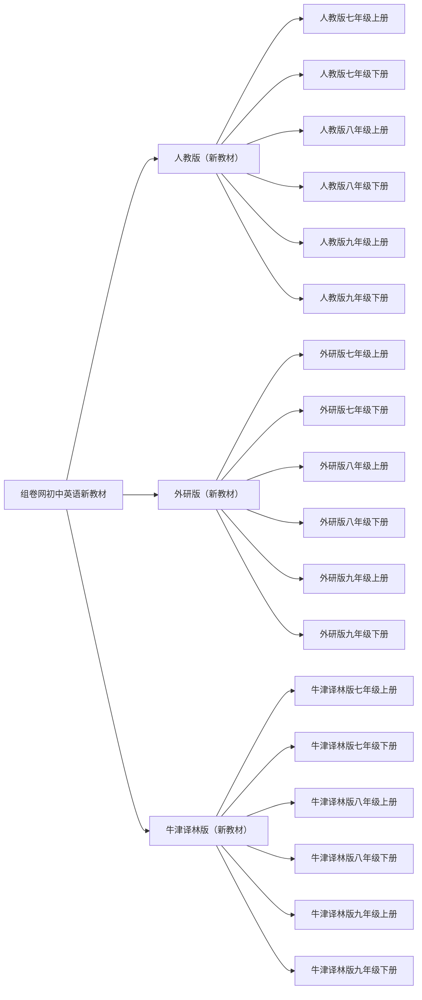
```mermaid
flowchart LR
  root["组卷网初中英语新教材"]
  v0["人教版（新教材）"]
  root --> v0
  v0b0["人教版七年级上册"]
  v0 --> v0b0
  v0b1["人教版七年级下册"]
  v0 --> v0b1
  v0b2["人教版八年级上册"]
  v0 --> v0b2
  v0b3["人教版八年级下册"]
  v0 --> v0b3
  v0b4["人教版九年级上册"]
  v0 --> v0b4
  v0b5["人教版九年级下册"]
  v0 --> v0b5
  v1["外研版（新教材）"]
  root --> v1
  v1b0["外研版七年级上册"]
  v1 --> v1b0
  v1b1["外研版七年级下册"]
  v1 --> v1b1
  v1b2["外研版八年级上册"]
  v1 --> v1b2
  v1b3["外研版八年级下册"]
  v1 --> v1b3
  v1b4["外研版九年级上册"]
  v1 --> v1b4
  v1b5["外研版九年级下册"]
  v1 --> v1b5
  v2["牛津译林版（新教材）"]
  root --> v2
  v2b0["牛津译林版七年级上册"]
  v2 --> v2b0
  v2b1["牛津译林版七年级下册"]
  v2 --> v2b1
  v2b2["牛津译林版八年级上册"]
  v2 --> v2b2
  v2b3["牛津译林版八年级下册"]
  v2 --> v2b3
  v2b4["牛津译林版九年级上册"]
  v2 --> v2b4
  v2b5["牛津译林版九年级下册"]
  v2 --> v2b5
```

### 分册单元与项目图

下列图示展示每册与其直接下属的 Starter、Unit、独立 Project。课时及活动编号等全部下级目录见前面的完整教材目录树。

#### 人教版（新教材）

##### 人教版七年级上册

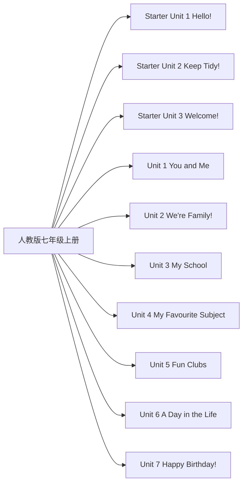
```mermaid
flowchart LR
  book["人教版七年级上册"]
  n196140["Starter Unit 1 Hello!"]
  book --> n196140
  n196149["Starter Unit 2 Keep Tidy!"]
  book --> n196149
  n196158["Starter Unit 3 Welcome!"]
  book --> n196158
  n196167["Unit 1 You and Me"]
  book --> n196167
  n196177["Unit 2 We're Family!"]
  book --> n196177
  n196187["Unit 3 My School"]
  book --> n196187
  n196197["Unit 4 My Favourite Subject"]
  book --> n196197
  n196207["Unit 5 Fun Clubs"]
  book --> n196207
  n196217["Unit 6 A Day in the Life"]
  book --> n196217
  n196227["Unit 7 Happy Birthday!"]
  book --> n196227
```

##### 人教版七年级下册

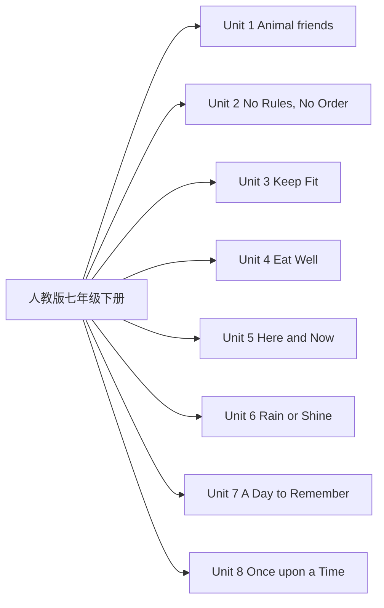
```mermaid
flowchart LR
  book["人教版七年级下册"]
  n211920["Unit 1 Animal friends"]
  book --> n211920
  n211930["Unit 2 No Rules, No Order"]
  book --> n211930
  n211940["Unit 3 Keep Fit"]
  book --> n211940
  n211950["Unit 4 Eat Well"]
  book --> n211950
  n211960["Unit 5 Here and Now"]
  book --> n211960
  n211970["Unit 6 Rain or Shine"]
  book --> n211970
  n211980["Unit 7 A Day to Remember"]
  book --> n211980
  n211990["Unit 8 Once upon a Time"]
  book --> n211990
```

##### 人教版八年级上册

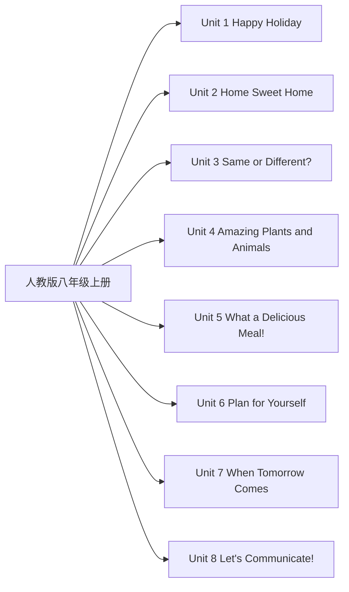
```mermaid
flowchart LR
  book["人教版八年级上册"]
  n224183["Unit 1 Happy Holiday"]
  book --> n224183
  n224194["Unit 2 Home Sweet Home"]
  book --> n224194
  n224205["Unit 3 Same or Different?"]
  book --> n224205
  n224216["Unit 4 Amazing Plants and Animals"]
  book --> n224216
  n224227["Unit 5 What a Delicious Meal!"]
  book --> n224227
  n224238["Unit 6 Plan for Yourself"]
  book --> n224238
  n224249["Unit 7 When Tomorrow Comes"]
  book --> n224249
  n224260["Unit 8 Let's Communicate!"]
  book --> n224260
```

##### 人教版八年级下册

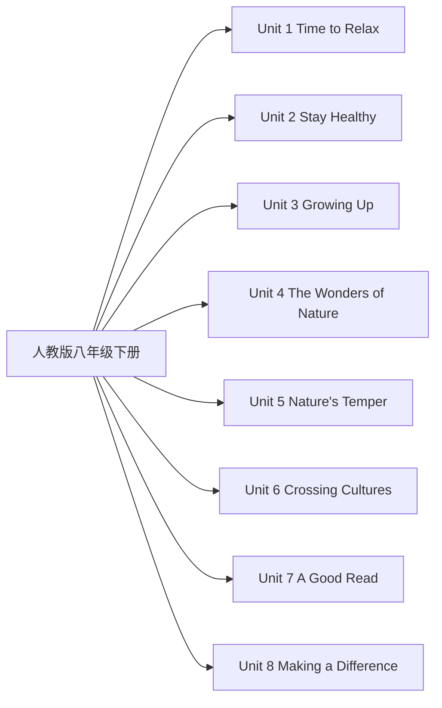
```mermaid
flowchart LR
  book["人教版八年级下册"]
  n236541["Unit 1 Time to Relax"]
  book --> n236541
  n236552["Unit 2 Stay Healthy"]
  book --> n236552
  n236563["Unit 3 Growing Up"]
  book --> n236563
  n236574["Unit 4 The Wonders of Nature"]
  book --> n236574
  n236585["Unit 5 Nature's Temper"]
  book --> n236585
  n236596["Unit 6 Crossing Cultures"]
  book --> n236596
  n236607["Unit 7 A Good Read"]
  book --> n236607
  n236618["Unit 8 Making a Difference"]
  book --> n236618
```

##### 人教版九年级上册

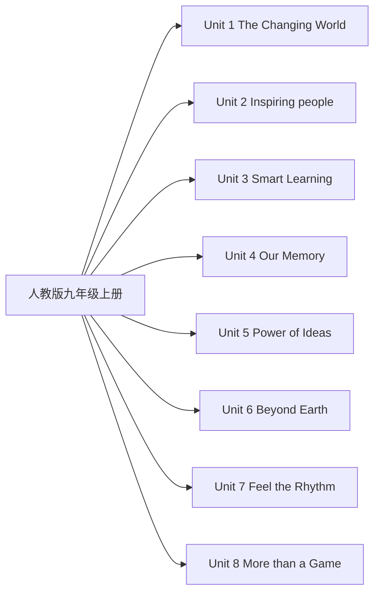
```mermaid
flowchart LR
  book["人教版九年级上册"]
  n260130["Unit 1 The Changing World"]
  book --> n260130
  n260142["Unit 2 Inspiring people"]
  book --> n260142
  n260154["Unit 3 Smart Learning"]
  book --> n260154
  n260166["Unit 4 Our Memory"]
  book --> n260166
  n260178["Unit 5 Power of Ideas"]
  book --> n260178
  n260190["Unit 6 Beyond Earth"]
  book --> n260190
  n260202["Unit 7 Feel the Rhythm"]
  book --> n260202
  n260214["Unit 8 More than a Game"]
  book --> n260214
```

##### 人教版九年级下册

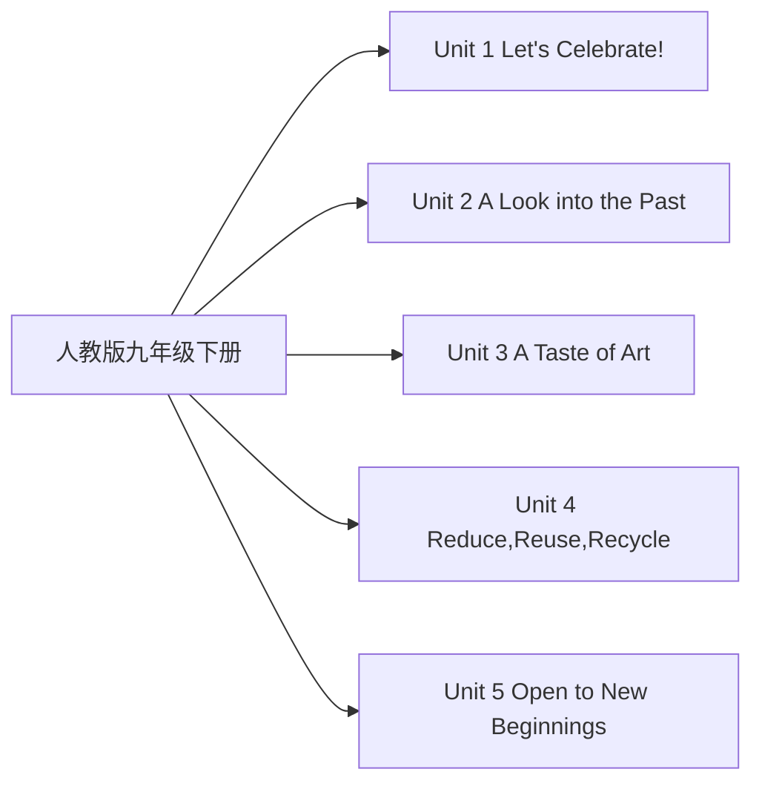
```mermaid
flowchart LR
  book["人教版九年级下册"]
  n270001["Unit 1 Let's Celebrate!"]
  book --> n270001
  n270002["Unit 2 A Look into the Past"]
  book --> n270002
  n270003["Unit 3 A Taste of Art"]
  book --> n270003
  n270004["Unit 4 Reduce,Reuse,Recycle"]
  book --> n270004
  n270005["Unit 5 Open to New Beginnings"]
  book --> n270005
```

#### 外研版（新教材）

##### 外研版七年级上册

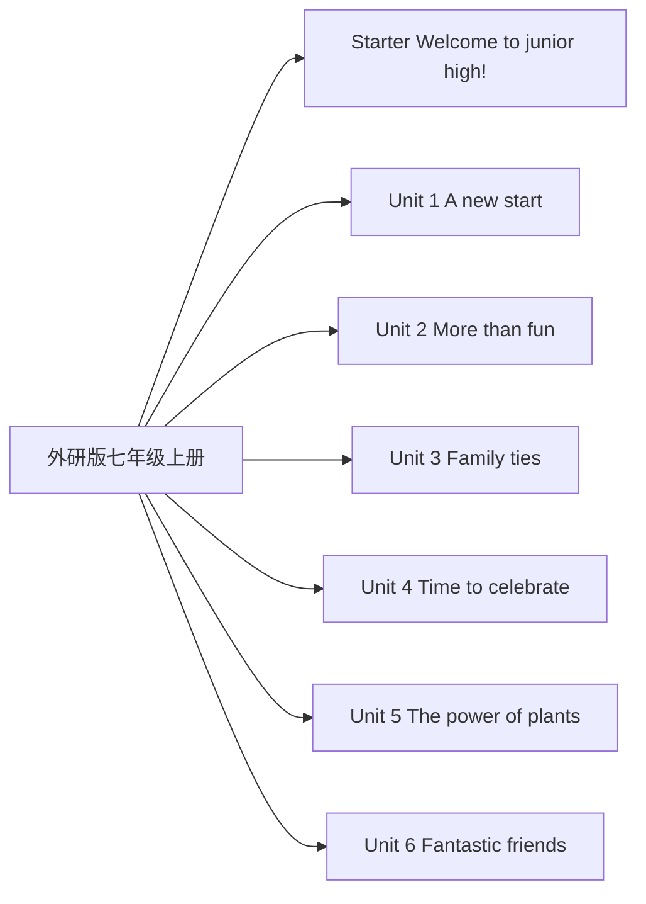
```mermaid
flowchart LR
  book["外研版七年级上册"]
  n199165["Starter Welcome to junior high!"]
  book --> n199165
  n199170["Unit 1 A new start"]
  book --> n199170
  n199176["Unit 2 More than fun"]
  book --> n199176
  n199182["Unit 3 Family ties"]
  book --> n199182
  n199188["Unit 4 Time to celebrate"]
  book --> n199188
  n199200["Unit 5 The power of plants"]
  book --> n199200
  n199194["Unit 6 Fantastic friends"]
  book --> n199194
```

##### 外研版七年级下册

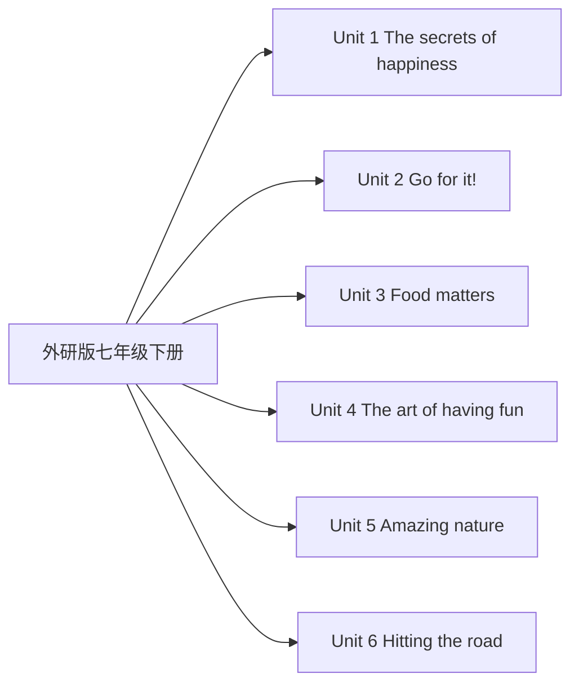
```mermaid
flowchart LR
  book["外研版七年级下册"]
  n212000["Unit 1 The secrets of happiness"]
  book --> n212000
  n212006["Unit 2 Go for it!"]
  book --> n212006
  n212012["Unit 3 Food matters"]
  book --> n212012
  n212018["Unit 4 The art of having fun"]
  book --> n212018
  n212024["Unit 5 Amazing nature"]
  book --> n212024
  n212030["Unit 6 Hitting the road"]
  book --> n212030
```

##### 外研版八年级上册

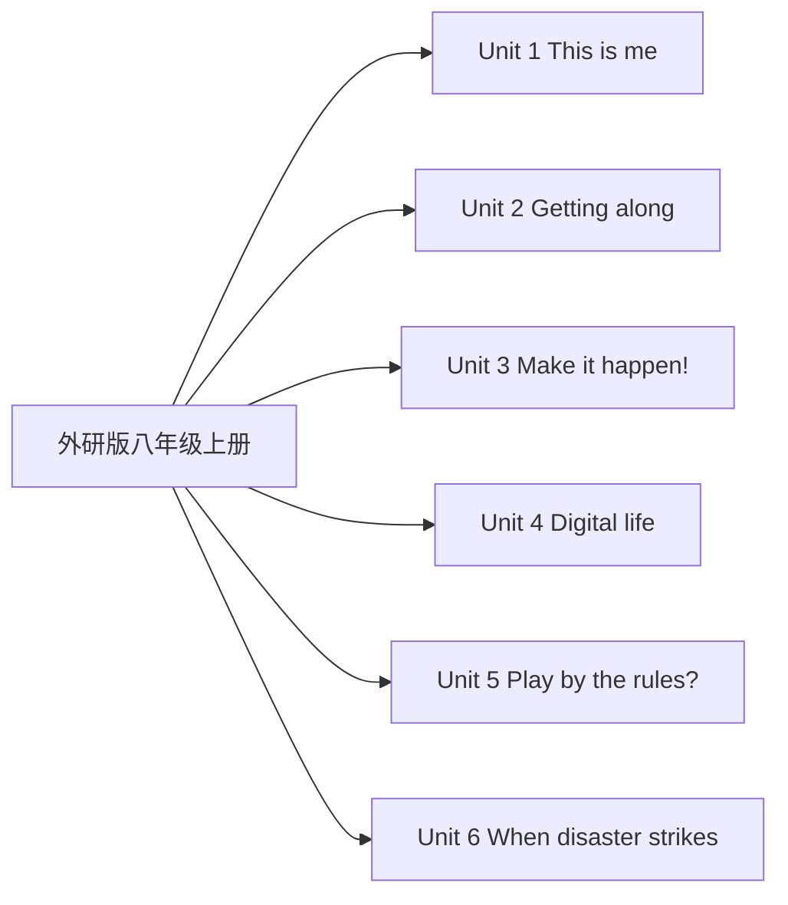
```mermaid
flowchart LR
  book["外研版八年级上册"]
  n224271["Unit 1 This is me"]
  book --> n224271
  n224277["Unit 2 Getting along"]
  book --> n224277
  n224283["Unit 3 Make it happen!"]
  book --> n224283
  n224289["Unit 4 Digital life"]
  book --> n224289
  n224295["Unit 5 Play by the rules?"]
  book --> n224295
  n224301["Unit 6 When disaster strikes"]
  book --> n224301
```

##### 外研版八年级下册

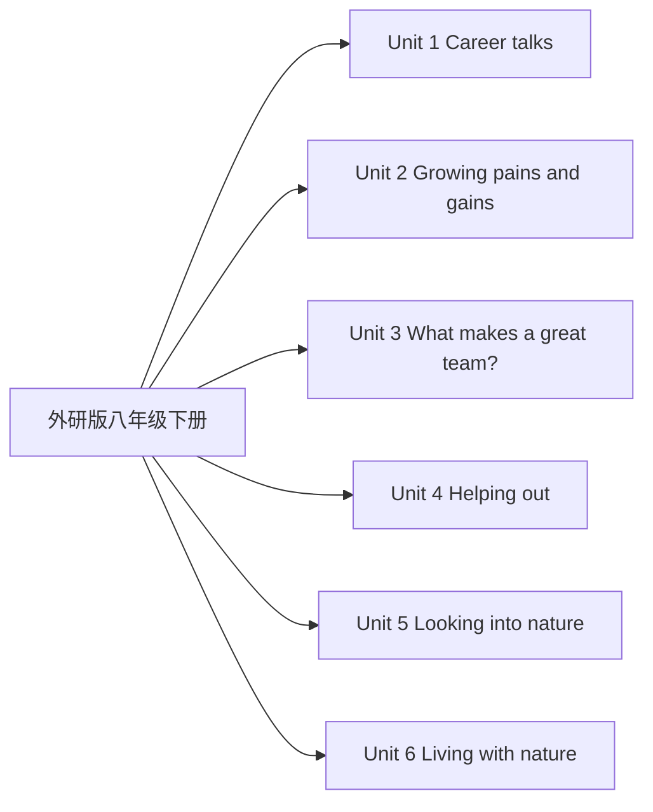
```mermaid
flowchart LR
  book["外研版八年级下册"]
  n236629["Unit 1 Career talks"]
  book --> n236629
  n236639["Unit 2 Growing pains and gains"]
  book --> n236639
  n236649["Unit 3 What makes a great team?"]
  book --> n236649
  n236659["Unit 4 Helping out"]
  book --> n236659
  n236669["Unit 5 Looking into nature"]
  book --> n236669
  n236679["Unit 6 Living with nature"]
  book --> n236679
```

##### 外研版九年级上册

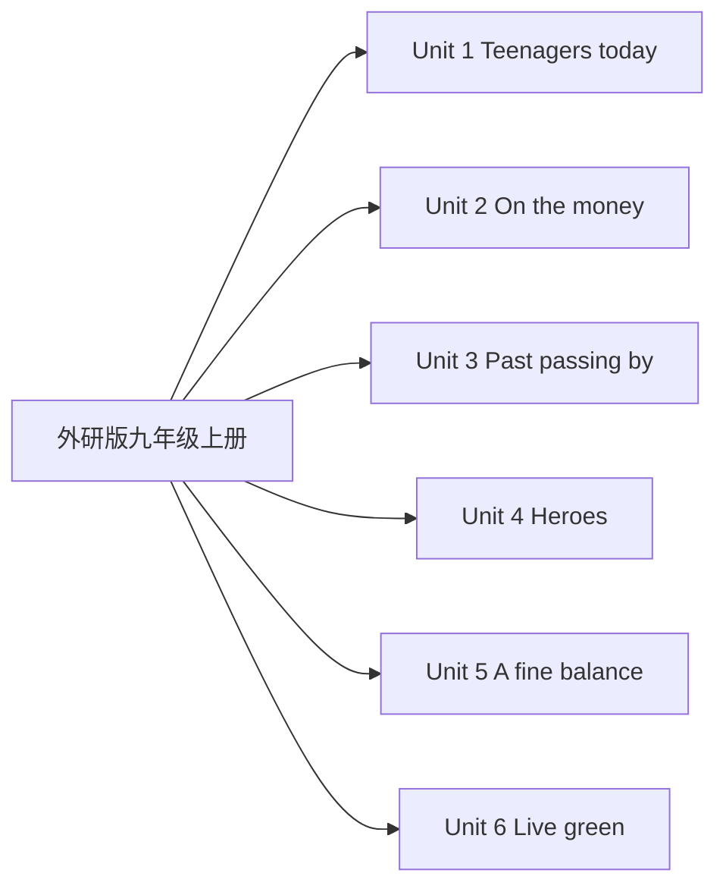
```mermaid
flowchart LR
  book["外研版九年级上册"]
  n261764["Unit 1 Teenagers today"]
  book --> n261764
  n261774["Unit 2 On the money"]
  book --> n261774
  n261784["Unit 3 Past passing by"]
  book --> n261784
  n261794["Unit 4 Heroes"]
  book --> n261794
  n261804["Unit 5 A fine balance"]
  book --> n261804
  n261814["Unit 6 Live green"]
  book --> n261814
```

##### 外研版九年级下册

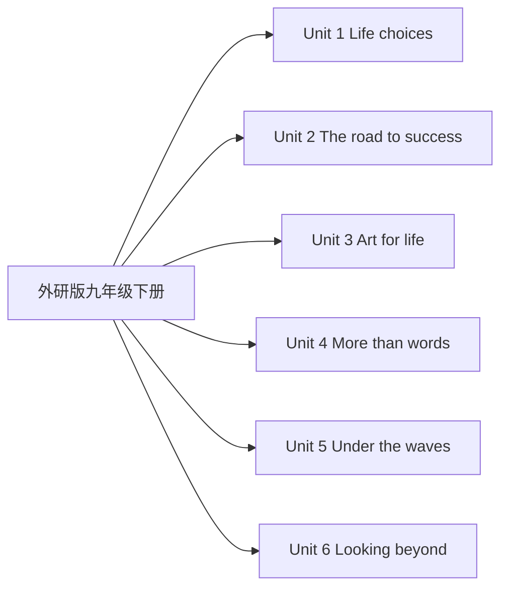
```mermaid
flowchart LR
  book["外研版九年级下册"]
  n271001["Unit 1 Life choices"]
  book --> n271001
  n271002["Unit 2 The road to success"]
  book --> n271002
  n271003["Unit 3 Art for life"]
  book --> n271003
  n271004["Unit 4 More than words"]
  book --> n271004
  n271005["Unit 5 Under the waves"]
  book --> n271005
  n271006["Unit 6 Looking beyond"]
  book --> n271006
```

#### 牛津译林版（新教材）

##### 牛津译林版七年级上册

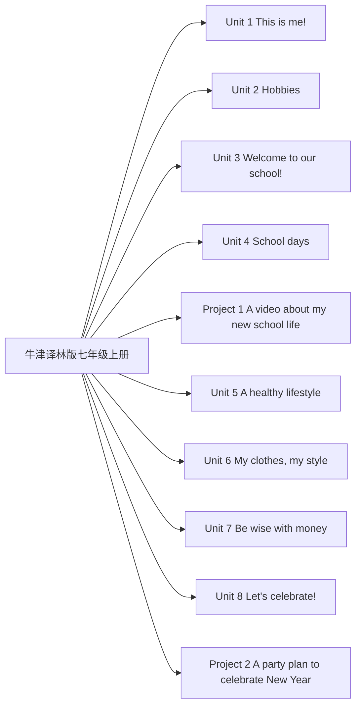
```mermaid
flowchart LR
  book["牛津译林版七年级上册"]
  n199206["Unit 1 This is me!"]
  book --> n199206
  n199214["Unit 2 Hobbies"]
  book --> n199214
  n199222["Unit 3 Welcome to our school!"]
  book --> n199222
  n199230["Unit 4 School days"]
  book --> n199230
  n261828["Project 1 A video about my new school life"]
  book --> n261828
  n199238["Unit 5 A healthy lifestyle"]
  book --> n199238
  n199246["Unit 6 My clothes, my style"]
  book --> n199246
  n199254["Unit 7 Be wise with money"]
  book --> n199254
  n199262["Unit 8 Let's celebrate!"]
  book --> n199262
  n261833["Project 2 A party plan to celebrate New Year"]
  book --> n261833
```

##### 牛津译林版七年级下册

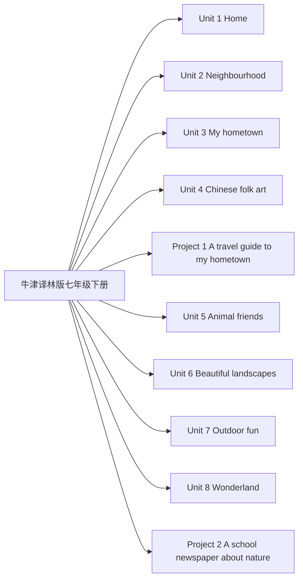
```mermaid
flowchart LR
  book["牛津译林版七年级下册"]
  n212036["Unit 1 Home"]
  book --> n212036
  n212044["Unit 2 Neighbourhood"]
  book --> n212044
  n212052["Unit 3 My hometown"]
  book --> n212052
  n212060["Unit 4 Chinese folk art"]
  book --> n212060
  n261838["Project 1 A travel guide to my hometown"]
  book --> n261838
  n212068["Unit 5 Animal friends"]
  book --> n212068
  n212076["Unit 6 Beautiful landscapes"]
  book --> n212076
  n212084["Unit 7 Outdoor fun"]
  book --> n212084
  n212092["Unit 8 Wonderland"]
  book --> n212092
  n261843["Project 2 A school newspaper about nature"]
  book --> n261843
```

##### 牛津译林版八年级上册

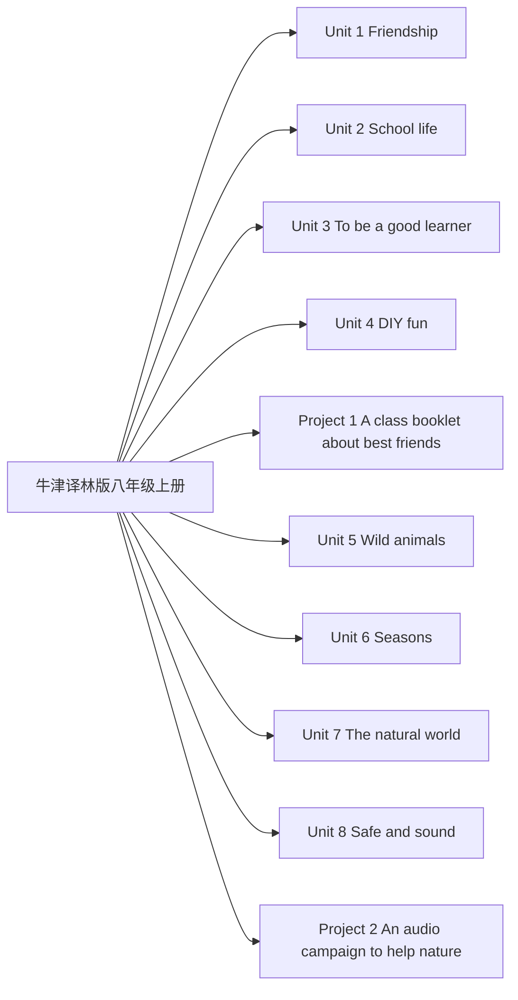
```mermaid
flowchart LR
  book["牛津译林版八年级上册"]
  n224307["Unit 1 Friendship"]
  book --> n224307
  n224315["Unit 2 School life"]
  book --> n224315
  n224323["Unit 3 To be a good learner"]
  book --> n224323
  n224331["Unit 4 DIY fun"]
  book --> n224331
  n261848["Project 1 A class booklet about best friends"]
  book --> n261848
  n224339["Unit 5 Wild animals"]
  book --> n224339
  n224347["Unit 6 Seasons"]
  book --> n224347
  n224355["Unit 7 The natural world"]
  book --> n224355
  n224363["Unit 8 Safe and sound"]
  book --> n224363
  n261853["Project 2 An audio campaign to help nature"]
  book --> n261853
```

##### 牛津译林版八年级下册

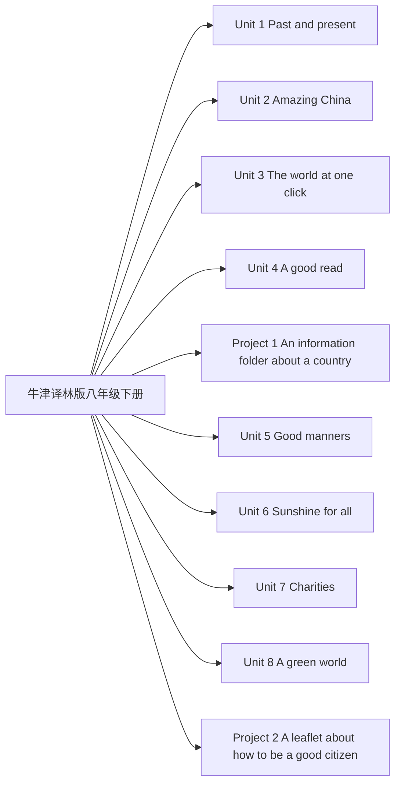
```mermaid
flowchart LR
  book["牛津译林版八年级下册"]
  n236689["Unit 1 Past and present"]
  book --> n236689
  n236697["Unit 2 Amazing China"]
  book --> n236697
  n236705["Unit 3 The world at one click"]
  book --> n236705
  n236713["Unit 4 A good read"]
  book --> n236713
  n236721["Project 1 An information folder about a country"]
  book --> n236721
  n236722["Unit 5 Good manners"]
  book --> n236722
  n236730["Unit 6 Sunshine for all"]
  book --> n236730
  n236738["Unit 7 Charities"]
  book --> n236738
  n236746["Unit 8 A green world"]
  book --> n236746
  n236754["Project 2 A leaflet about how to be a good citizen"]
  book --> n236754
```

##### 牛津译林版九年级上册

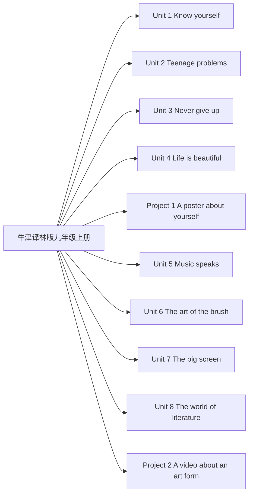
```mermaid
flowchart LR
  book["牛津译林版九年级上册"]
  n261854["Unit 1 Know yourself"]
  book --> n261854
  n261862["Unit 2 Teenage problems"]
  book --> n261862
  n261870["Unit 3 Never give up"]
  book --> n261870
  n261878["Unit 4 Life is beautiful"]
  book --> n261878
  n263590["Project 1 A poster about yourself"]
  book --> n263590
  n261886["Unit 5 Music speaks"]
  book --> n261886
  n261894["Unit 6 The art of the brush"]
  book --> n261894
  n261902["Unit 7 The big screen"]
  book --> n261902
  n261910["Unit 8 The world of literature"]
  book --> n261910
  n263591["Project 2 A video about an art form"]
  book --> n263591
```

##### 牛津译林版九年级下册

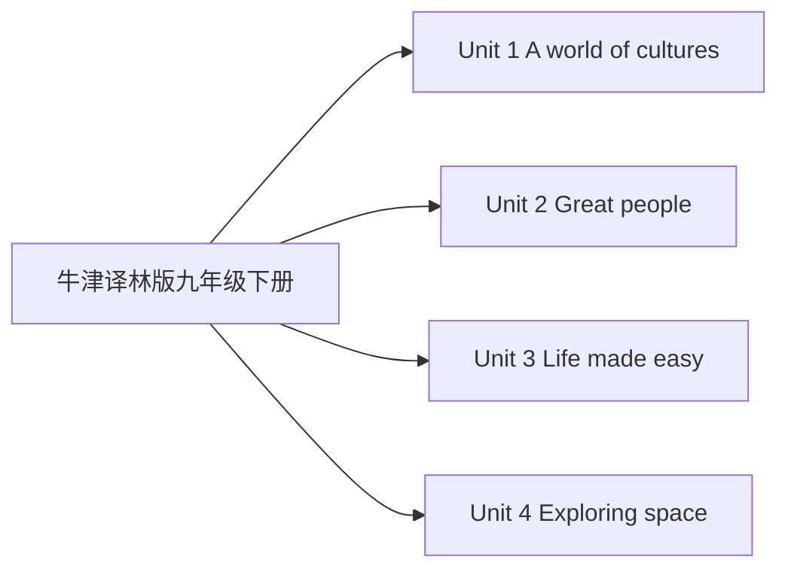
```mermaid
flowchart LR
  book["牛津译林版九年级下册"]
  n272001["Unit 1 A world of cultures"]
  book --> n272001
  n272002["Unit 2 Great people"]
  book --> n272002
  n272003["Unit 3 Life made easy"]
  book --> n272003
  n272004["Unit 4 Exploring space"]
  book --> n272004
```

### 单元内部层级示例

各取三版本七年级上册 Unit 1，展示三个版本的实际下级栏目。以下为所选单元的全部已保存目录节点；其余单元的完整层级均已列入前面的目录树。

#### 人教版（新教材） · 人教版七年级上册 · Unit 1 You and Me

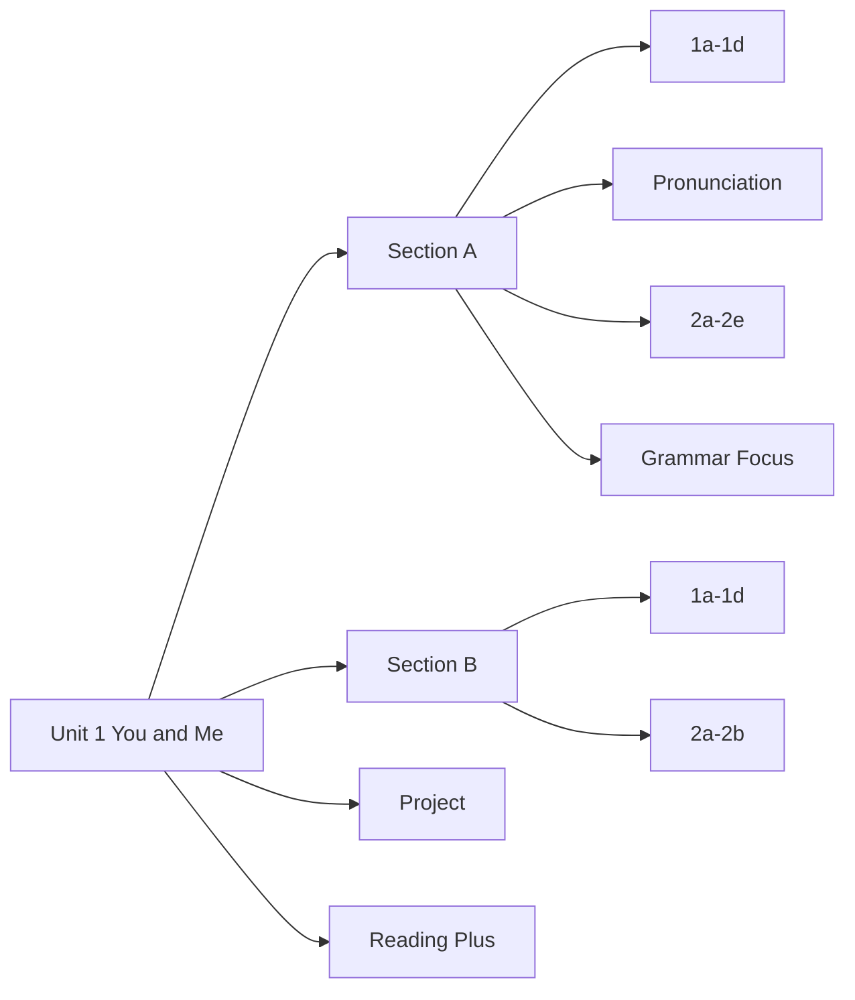
```mermaid
flowchart LR
  n196167["Unit 1 You and Me"]
  n196168["Section A"]
  n196167 --> n196168
  n196169["1a-1d"]
  n196168 --> n196169
  n196170["Pronunciation"]
  n196168 --> n196170
  n196171["2a-2e"]
  n196168 --> n196171
  n196172["Grammar Focus"]
  n196168 --> n196172
  n196173["Section B"]
  n196167 --> n196173
  n196174["1a-1d"]
  n196173 --> n196174
  n196175["2a-2b"]
  n196173 --> n196175
  n196176["Project"]
  n196167 --> n196176
  n260099["Reading Plus"]
  n196167 --> n260099
```

#### 外研版（新教材） · 外研版七年级上册 · Unit 1 A new start

```mermaid
flowchart LR
  n199170["Unit 1 A new start"]
  n199171["Starting out"]
  n199170 --> n199171
  n199172["Understanding ideas"]
  n199170 --> n199172
  n261692["Reading"]
  n199172 --> n261692
  n261693["Grammar"]
  n199172 --> n261693
  n199173["Developing ideas"]
  n199170 --> n199173
  n261694["Listening and speaking"]
  n199173 --> n261694
  n261695["Reading for writing"]
  n199173 --> n261695
  n199174["Presenting ideas"]
  n199170 --> n199174
  n199175["Reflection"]
  n199170 --> n199175
```

#### 牛津译林版（新教材） · 牛津译林版七年级上册 · Unit 1 This is me!

```mermaid
flowchart LR
  n199206["Unit 1 This is me!"]
  n199207["Welcome to the unit"]
  n199206 --> n199207
  n199208["Reading"]
  n199206 --> n199208
  n199209["Grammar"]
  n199206 --> n199209
  n199210["Pronunciation"]
  n199206 --> n199210
  n199211["Integration"]
  n199206 --> n199211
  n199212["Assessment"]
  n199206 --> n199212
  n199213["Further study"]
  n199206 --> n199213

```

## 来源文件

以下记录实际提取目录的组卷网网页文件，以及九年级下册补录所依据的课时划分文件。

| 教材版本 | 册次    | 来源网页文件                               |
| ---- | ----- | ------------------------------------ |
| 人教版  | 七年级上册 | 1a-1d练习题_试题及答案-初中英语人教版七年级上册-组卷网.html |
| 人教版  | 七年级下册 | 七年级下册练习题_试题及答案-初中英语人教版七年级下册-组卷网.html |
| 人教版  | 八年级上册 | 八年级上册练习题_试题及答案-初中英语人教版八年级上册-组卷网.html |
| 人教版  | 八年级下册 | 八年级下册练习题_试题及答案-初中英语人教版八年级下册-组卷网.html |
| 人教版  | 九年级上册 | 九年级上册练习题_试题及答案-初中英语人教版九年级上册-组卷网.html |
| 人教版  | 九年级下册 | 九下英语人教版 课时划分.docx                    |
| 外研版  | 七年级上册 | 七年级上册练习题_试题及答案-初中英语外研版七年级上册-组卷网.html |
| 外研版  | 七年级下册 | 七年级下册练习题_试题及答案-初中英语外研版七年级下册-组卷网.html |
| 外研版  | 八年级上册 | 八年级上册练习题_试题及答案-初中英语外研版八年级上册-组卷网.html |
| 外研版  | 八年级下册 | 八年级下册练习题_试题及答案-初中英语外研版八年级下册-组卷网.html |
| 外研版  | 九年级上册 | 九年级上册练习题_试题及答案-初中英语外研版九年级上册-组卷网.html |
| 外研版  | 九年级下册 | 九下英语外研版 课时划分.docx                    |
| 译林版  | 七年级上册 | 七年级上册练习题_试题及答案-初中英语译林版七年级上册-组卷网.html |
| 译林版  | 七年级下册 | 七年级下册练习题_试题及答案-初中英语译林版七年级下册-组卷网.html |
| 译林版  | 八年级上册 | 八年级上册练习题_试题及答案-初中英语译林版八年级上册-组卷网.html |
| 译林版  | 八年级下册 | 八年级下册练习题_试题及答案-初中英语译林版八年级下册-组卷网.html |
| 译林版  | 九年级上册 | 九年级上册练习题_试题及答案-初中英语译林版九年级上册-组卷网.html |
| 译林版  | 九年级下册 | 九下英语译林版 课时划分.docx                    |

重复文件：1a-1d练习题_试题及答案-初中英语人教版七年级上册-组卷网(1).html；与1a-1d练习题_试题及答案-初中英语人教版七年级上册-组卷网.html内容一致，目录只收录一次。
